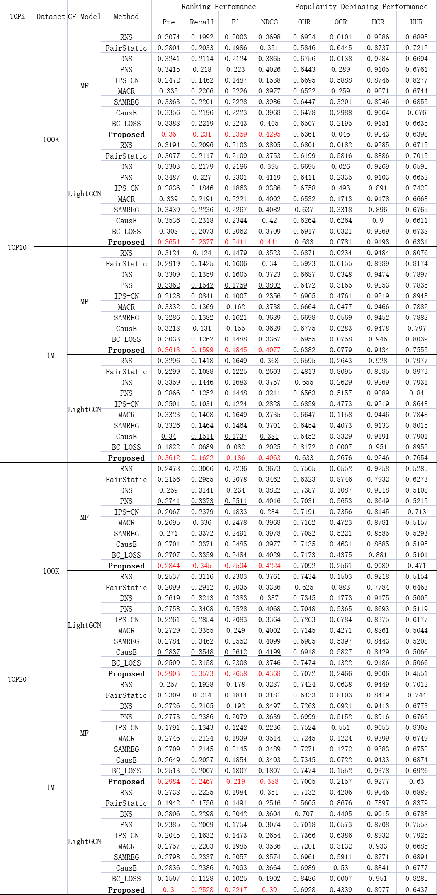

## Brief Introduction
This thesis presents AUC-optimal negative sampling for implicit collaborative filtering, which aims to address the issue of popularity bias by achieving a high true positive rate within a specific range of false positive rates.
## Prerequisites
- Python 3.8 
- PyTorch 1.11.0

## Supplementary experiments
The top10 and top20 recommendation performance of the AUC_NS negative sampling algorithm on 1M and 100k is shown below, and we can get the same conclusion as in the paper.

## Some Tips
Flags in `parse.py`:

Model training related settings:

- `--train_mode` Choosing to either start a new training session, or continue training with the model saved from your previous session.
- `--encoder` Choosing MF or LightGCTN as the Backbone of the CF model.
- `--epochs` Number of sweeps over the dataset to train.
- `--dataset` Choosing 100k, yahoo, 1M, or your dataset.

You can set the relevant parameters for model training,

- `--batch_size` size of each batch
- `--l2` l2 regulation constant.
- `--lr` learning rate.
- `--lr_dc` learning rate decay rate.
- `--lr_dc_epoch` training epoch at which the learning rate starts to decay.

Suggested training parameters parameters are:
#### Suggested Model Training Parameters
|                    | batch_size |  l2   |  lr  | lr_dc | lr_dc_epoch  | hop | 
|--------------------|:----------:|:-----:|:----:|:-----:|:------------:|-----|
| 100k-MF            |    128     | 1e-4  | 0.1  |  0.1  |  [20,60,80]  | /   |
| 100k-LightGCN      |    1024    | 1e-5  | 0.1  |  0.1  |  [20,60,80]  | 2   |
| 1M-MF              |    128     | 1e-5  | 5e-4 |   1   |      []      | /   |
| 1M-LightGCN        |    1024    |   0   | 1e-3 |   1   |      []      | 2   |
| Gowalla-MF         |    1024    |   0   | 5e-4 |   1   |      []      | /   |
| Gowalla-LightGCN   |    1024    |   0   | 5e-4 |   1   |      []      | 3   |
| Yelp2018-MF        |    1024    |   0   | 5e-4 |   1   |      []      | /   |
| Yelp2018-LightGCN  |    1024    |   0   | 5e-4 |   1   |      []      | 3   |
AUC-optimal negative sampling related parameters:

- `--alpha` denote the probability that the decision function assigns a higher score to a positive example than a negative example,which corresponds to macro-AUC of encoder that accounts for model-dependent bias correction.


- `--beta` modifies the prior information to reduce the model-independent bias. Specifically, it is the concentration parameter that controls the probability of popular items being true negatives.

- `--gama` controls the range of false positive rates that we aim to achieve a high true positive rate within. For top-k evaluation tasks, a smaller value of gama should be chosen as the value of k decreases.

- `--N` size of the additional positive and negative samples used to estimate the sum of gradients. Larger N can provide more  accurate AUC information at the cost of longer training times.We fixed this parameter to 10 in our experiments.

Suggested AUC_NS parameters are:
#### Suggested AUC_NS Parameters
|                   | $\alpha$ | $\beta$ | $\gamma$ |
|-------------------|:--------:|:-------:|:--------:|
| 100k-MF           |   0.60   |  0.025  |  0.006   | 
| 100k-LightGCN     |   0.75   |  0.025  |  0.006   |
| 1M-MF             |   0.60   |  0.025  |  0.006   |
| 1M-LightGCN       |   0.75   |  0.025  |  0.006   |
| Gowalla-MF        |   0.75   |  0.001  |  0.006   |
| Gowalla-LightGCN  |   0.75   |  0.001  |  0.006   |
| Yelp2018-MF       |   0.75   |  0.001  |  0.006   |
| Yelp2018-LightGCN |   0.75   |  0.001  |  0.006   |

For instance, execute the following command to train CF model using AUC_NS method.
```
python main.py --alpha 0.65 --beta 0.025 --gama 0.006
```
